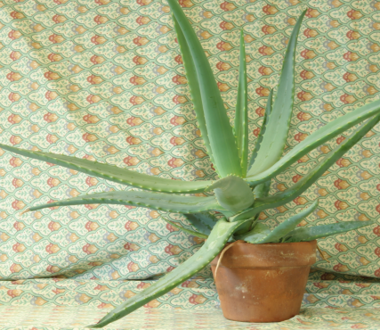
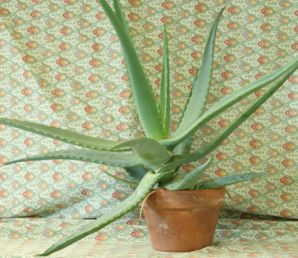
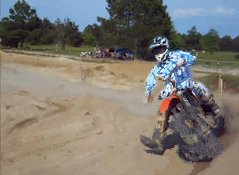
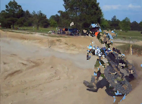

## 实现论文
### PatchMatch: A Randomized Correspondence Algorithm for Structural Image Editing

## 项目说明
本项目实现了PatchMatch图像匹配算法，有c++和python两个版本。  
功能：输入图片A和B，寻找A中每个像素在B中的对应位置，然后使用B的像素重建A

## 项目依赖
1. c++: opencv, eigen  
2. python: cv2(opencv), numpy

## 运行方法
### 1. c++:
   1) cd project_path
   2) mkdir build
   3) cmake ..
   4) make
   5) ./PatchMatch imageA_path imageB_path out_path

### 2. python:
   1) python PatchMatch.py imageA_path imageB_path out_path

## 实验结果
实验结果放在exam文件夹下

|原图片A | 目标图片B | c++版重建图片 | python版重建图片|
|---|---|---|---|
|||||
||||
